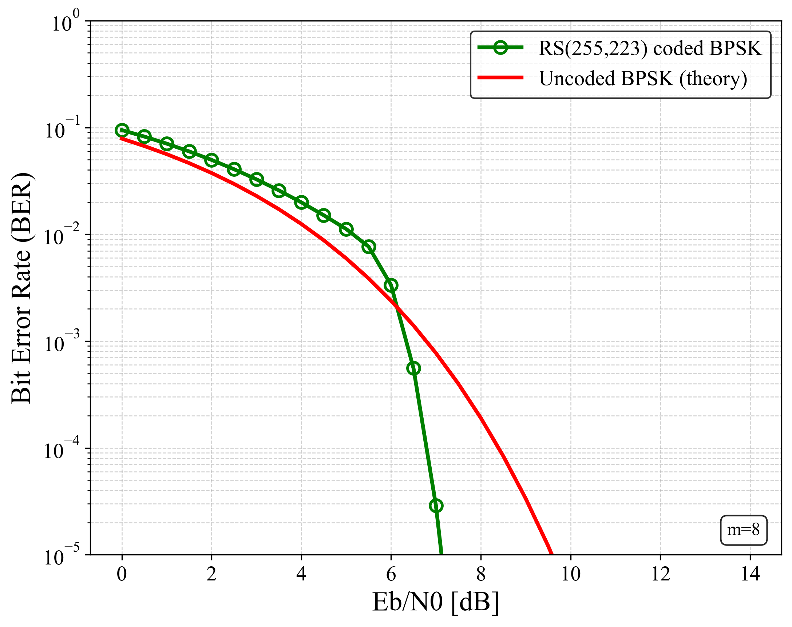
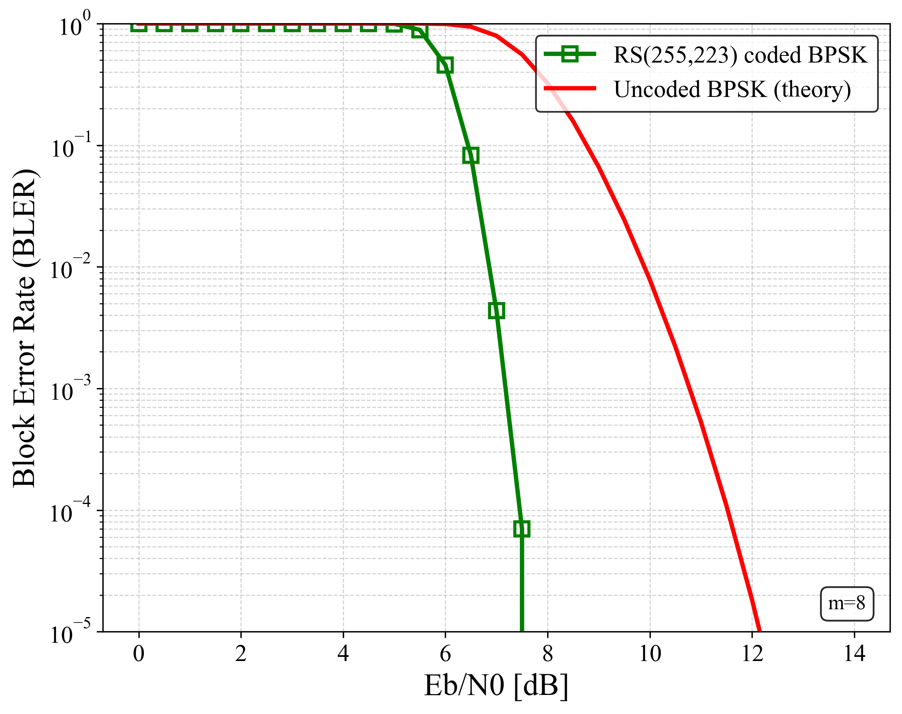

# fec-rs-codec


A clean and modular Reed–Solomon Codec implementation
supporting GF(2^m) arithmetic, shortened RS(N,K),
systematic encoding, and Berlekamp–Massey decoding
with AWGN BER/BLER simulation (BPSK, hard decision).

---

## 📘 Overview

This repository provides a standalone C implementation of
**Reed–Solomon Forward Error Correction (RS-FEC)** suitable for:

- Wireless communication (5G/6G, DVB, optical, satellite)
- Storage (CD/DVD, RAID, QR codes)
- Embedded systems and firmware
- Error-correcting code education and research

Included components:

- GF(2^m) arithmetic: log/exp tables, multiplication, division, inversion
- Generator polynomial construction (any m, N, K, T)
- Systematic RS encoder
- Berlekamp–Massey algorithm (error locator)
- Chien search (error position search)
- Forney algorithm–based error magnitude solving
- Shortened RS support (arbitrary N ≤ 2^m − 1)
- AWGN BER/BLER simulation (BPSK, hard decision)

---

## 📁 Project Structure

```
fec-rs-codec
├── src/                 # GF arithmetic, encoder, decoder core
├── include/             # Public header files
├── mains/               # BER/BLER simulation (AWGN+BPSK)
├── results/             # Generated BER & BLER CSV
├── images/              # Plots generated from Python
├── python/              # Plotting scripts (BER/BLER visualization)
├── .github/workflows/   # CI pipeline (GCC/Clang)
├── Makefile             # Build rules
└── README.md            # This document
```

---

## 📑 Features

### ✔ Reed–Solomon Codec

- Supports any GF(2^m) up to **m ≤ 8**
- Arbitrary shortened RS(N,K)
- Efficient **log/exp–based** multiplication/division
- Automatic generator polynomial construction (G(x))
- Systematic encoding
- Full decoding chain:
  - Syndrome computation
  - Berlekamp–Massey
  - Chien search
  - Error magnitude solving (Forney)
  - Codeword correction on parent RS length

### ✔ AWGN BER/BLER Simulation

The program `mains/rs_ber_bler.c` evaluates:

- **BER** (Bit Error Rate)
- **BLER** (Block Error Rate)

under BPSK modulation and hard-decision demodulation.

Output format (auto-named using m,N,K):

```
results/rs_ber_m8_N255_K223.csv
results/rs_bler_m8_N255_K223.csv
```

Python scripts automatically visualize performance.

---

## 🛠 Build Instructions

### Requirements

- GCC or Clang
- `make`
- Linux / macOS / WSL / MinGW

---

### Build

```sh
make
```

Generated binary:

```
rs_ber_bler   # BER/BLER simulation
```

Clean build:

```sh
make clean
```

---

## 🚀 Usage Example

Run BER/BLER simulation:

```sh
./rs_ber_bler
```

Output files:

```
results/rs_ber_m8_N255_K223.csv
results/rs_bler_m8_N255_K223.csv
```

Plot results:

```sh
python python/plot_rs_ber_bler.py
```

---

## 📉 BER/BLER Performance

Example BER graph for **RS(255,223), GF(2^8)** (BPSK, AWGN):



Example BLER graph:



---

## 📂 Source Code Structure

### src/
| File | Description |
|------|-------------|
| `rs_gf.c` | GF(2^m) operations, generator polynomial |
| `rs_encoder.c` | Systematic RS encoder |
| `rs_decoder.c` | BM + Chien search + Forney RS decoder |

### include/
| File | Description |
|------|-------------|
| `rs_gf.h` | GF arithmetic API |
| `rs_encoder.h` | Encoder API |
| `rs_decoder.h` | Decoder API |

### mains/
| File | Description |
|------|-------------|
| `rs_ber_bler.c` | AWGN BER/BLER simulation program |

### python/
| File | Description |
|------|-------------|
| `plot_rs_ber_bler.py` | Plot BER/BLER graphs |

---

## 🔒 Confidentiality Notice

All source code in this repository was developed independently
based only on public standards (3GPP) and academic knowledge.
No confidential or proprietary information from any company,
internship, or NDA-protected source is used.

---

## 📜 License

This project is licensed under the **MIT License**.
It is free for research, education, and commercial use.

---

## 🤝 Contributing

Pull requests are welcome.
For major changes, please open an issue first.

---

## ⭐ Acknowledgements

Developed as part of research on
**Forward Error Correction (FEC)** and **physical-layer communications**.

If you find this repository helpful,
please consider giving it a ⭐ on GitHub!
